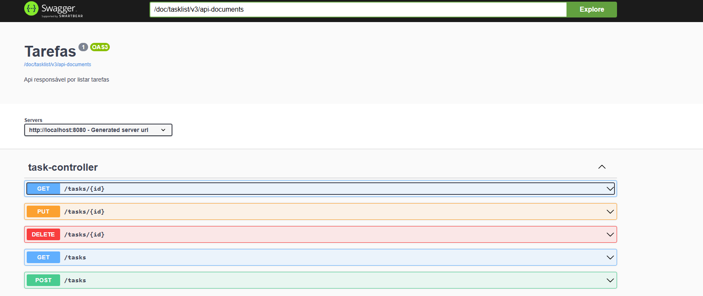

## 📝 TaskList API

API REST para gerenciamento de uma lista de tarefas, desenvolvida em Java com Spring Boot. Permite criar, listar, consultar, atualizar e excluir tarefas, com validações e regras de negócio para garantir a integridade dos dados. Suporta banco em memória (H2) para testes e PostgreSQL para ambiente de produção.
# Imagem do projeto

## 🛠 Stack Utilizada

- **[Java 17]**
- **[Spring Boot 3]**
- **[Spring Data JPA]**
- **[Hibernate Validator]**
- **[PostgreSQL / H2 (ambiente de teste)]**
- **[Lombok]**
- **[Postman]**
- **[JUnit 5 + Mockito]**
- **[Springdoc OpenAPI (Swagger)]**
- **[Gradle]**

## 📦 Funcionalidades do projeto

###  Criar uma tarefa
POST /tasks
**Exemplo de Body (JSON):**
-Body (JSON):
{
"title": "Comprar pão",
"description": "Pão integral na padaria X",
"status": "PENDENTE"
}

🔹 Buscar todas as tarefas
GET /tasks

🔹 Buscar tarefa por ID
 GET /tasks/{id}

🔹 Atualizar tarefa
- PUT /tasks/{id}

-Body (JSON):
{
"title": "Comprar pão",
"description": "Pão integral na padaria X",
"status": "PENDENTE"
}

🔹 Excluir tarefa
DELETE /tasks/{id}

# 📖 Regras de negócio
Não é permitido criar duas tarefas com o mesmo título e status PENDENTE.

Validações:
title obrigatório (5 a 100 caracteres)
status obrigatório (valores válidos: PENDENTE, CONCLUIDA)

# 🧪 Testes automatizados
Os testes de unidade cobrem as principais regras de negócio do TaskService, usando JUnit e Mockito.
Rodar testes:
./gradlew test

# 📚 Documentação Swagger

Após iniciar a aplicação, acesse:
http://localhost:8080/swagger-ui.html

# 🛠️ Como Rodar Localmente

Clone o repositório:

## Para Clonar o projeto
https://github.com/JacquelineCasali/fullstack1
cd fullstack1/jtech-tasklist-backend

2. Ajuste as configurações no arquivo application.yml conforme sua ambiente.
   Por padrão, usa banco em memória H2 para facilitar testes.
3. Execute o projeto:
./gradlew bootRun
   Acesse a API em http://localhost:8080/tasks

## Como Rodar os Testes

Os testes de unidade cobrem as principais regras do serviço de tarefas, utilizando JUnit 5 e Mockito.
Para rodar os testes, execute:
./gradlew test

## Decisões Técnicas

-- H2 para testes: Facilita o desenvolvimento e testes locais por ser um banco em memória, eliminando a necessidade de configuração adicional.
-- PostgreSQL para produção: Banco relacional robusto e amplamente usado em aplicações reais.
-- Spring Boot: Framework rápido e confiável para APIs REST, com suporte integrado a JPA, segurança, e validação.
-- Lombok: Reduz boilerplate de código para getters/setters, facilitando a manutenção.
-- Hibernate Validator: Para garantir regras de validação nos dados de entrada com anotações.
-- Springdoc OpenAPI: Geração automática da documentação Swagger, facilitando testes e consumo da API.

## Melhorias Futuras
-- Implementar autenticação e autorização (ex: JWT).
-- Criar endpoints paginados para listagem de tarefas.
-- Adicionar filtros e busca avançada (por status, título, etc).
-- Suporte a upload de arquivos (ex: anexos às tarefas).
-- Monitoramento e métricas usando Spring Boot Actuator.

# Licença
Projeto desenvolvido por Jacqueline Casali.

