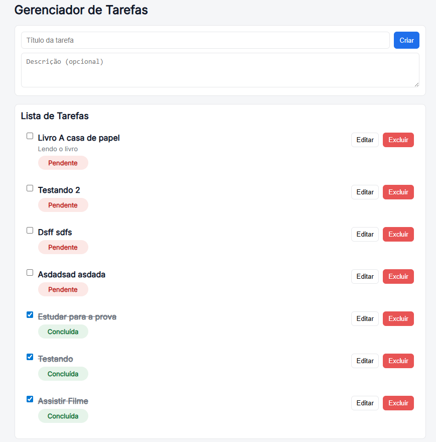

## 📋 Lista de Tarefas (To-Do List)

Aplicação simples de gerenciamento de tarefas, onde é possível adicionar, editar, concluir e excluir tarefas.
As tarefas concluídas aparecem riscadas e ao final da lista, enquanto as pendentes aparecem primeiro.

## 🚀 Imagem do Projeto 

## 🚀 Tecnologias

-Frontend: React.js + Vite
-Banco de Dados: PostgreSQL (pode ser h2 também)
-Outros: Axios

## ⚙️ Instalação e Execução
1️⃣ Clonar o repositório
git clone https://github.com/JacquelineCasali/fullstack1
cd jtech-tasklist-frontend

O backend sobe em: http://localhost:8080

3️⃣ Frontend
cd frontend
npm install
npm run dev

O frontend abre em: http://localhost:5173

# 📌 Funcionalidades

✅ Criar novas tarefas
✅ Editar título e descrição
✅ Marcar tarefa como concluída (fica riscada e no final da lista)
✅ Excluir tarefa
✅ Ordenar pendentes primeiro

## 🎨 Interface

- As tarefas pendentes aparecem primeiro.
- Status Concluída → verde
- Status Pendente → vermelho

## 🛠️ Melhorias Futuras

-Autenticação de usuário
-Filtros de busca (por título/status)
-Deploy em produção